<div id="top"></div>

<div align="center">
  <h1>Arduino 3D Models</h1>
  <p><em>Coleção Detalhada de Modelos 3D do Arduino e Seus Componentes em CATIA V5</em></p>

  
  
  

  <p><em>Desenvolvido com a ferramenta:</em></p>
  
</div>

---

## 📜 Índice
- [Visão Geral](#-visão-geral)
- [Estrutura do Projeto](#-estrutura-do-projeto)
- [Como Começar](#-como-começar)
- [Galeria](#-galeria)

---

## 🚀 Visão Geral
Este repositório contém uma coleção completa de modelos 3D de uma placa Arduino e seus componentes eletrônicos individuais, todos criados com o software CATIA V5. O objetivo é fornecer modelos precisos para fins educacionais, integração em projetos mecânicos maiores e visualização de hardware.

**Por que este projeto?**

Este projeto oferece recursos valiosos para estudantes, engenheiros e entusiastas que precisam de representações digitais de hardware eletrônico. As principais características incluem:

-   📐 **Alta Precisão:** Modelos detalhados que representam as dimensões e a aparência dos componentes reais.
-   🧩 **Design Modular:** Cada componente é um arquivo `.CATPart` separado, facilitando o uso individual ou em montagens (`.CATProduct`).
-   🔧 **Compatibilidade:** Ideal para ser integrado em projetos de engenharia mecânica que interagem com eletrônicos.
-   🎓 **Recurso Educacional:** Perfeito para aprender sobre a construção física de placas de circuito e componentes eletrônicos.

---

## 🏗️ Estrutura do Projeto
O repositório está organizado com arquivos de peças (`.CATPart`) para cada componente individual e arquivos de produto (`.CATProduct`) que reúnem as peças em montagens.

#### Componentes Modelados
A coleção inclui, mas não se limita a:
-   **Microcontrolador:** ATmega 2560
-   **Capacitores:** 0603, 1206
-   **Resistores:** 0603
-   **LEDs:** 0603 (Azul, Verde)
-   **Diodos e Fusíveis:** Diode SMD, Fuse 1206
-   **Conectores:** Micro USB, Pinos de conexão
-   **Circuitos Integrados:** SOIC 16, SOT223
-   **Outros:** Oscilador de Cristal, Botões (SWT 32)
-   **Montagens Finais:** `Montagem Final.CATProduct`, `ATmega 2560.CATProduct`

---

## 🏁 Como Começar

### Pré-requisitos
Para visualizar e editar os arquivos nativos deste projeto, você precisará de:
-   **Software CAD:** Dassault Systèmes CATIA V5 ou um software compatível que possa importar arquivos `.CATPart` e `.CATProduct`.

### Como Usar
1.  **Clone o repositório:**
    ```sh
    git clone [https://github.com/theofeitoza/Arduino.git](https://github.com/theofeitoza/Arduino.git)
    ```
2.  **Navegue até o diretório do projeto:**
    ```sh
    cd Arduino
    ```
3.  **Abra os arquivos:**
    -   Use o CATIA V5 para abrir os arquivos `.CATPart` (peças individuais) ou `.CATProduct` (montagens completas).
    -   Para quem não possui o software, a pasta do projeto contém imagens (`.JPG`, `.png`) para visualização rápida dos modelos.

---

## 🖼️ Galeria
Abaixo estão algumas renderizações dos modelos contidos neste repositório.

### Montagem Final
<p align="center">
  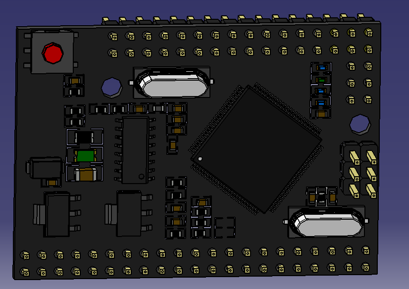
</p>
<p align="center">
  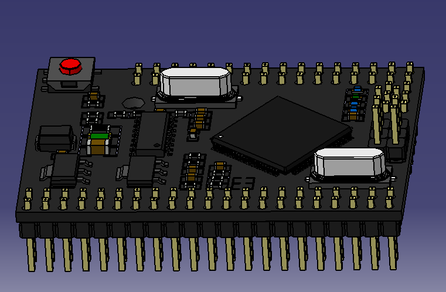
</p>

### Componentes Individuais
<p align="center">
  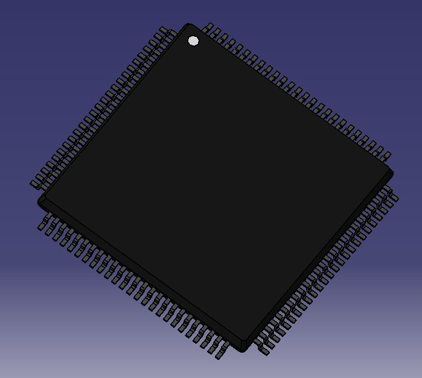
  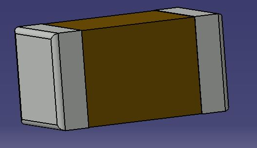
  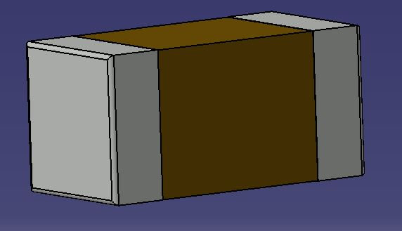
</p>
<p align="center">
  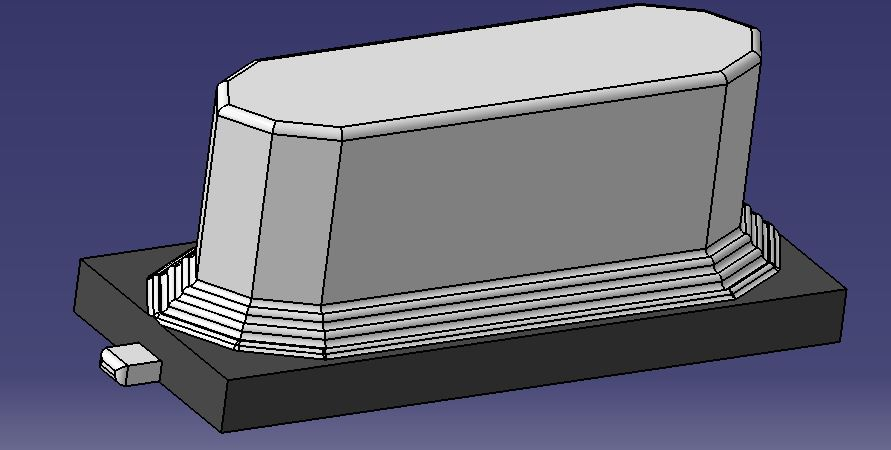
  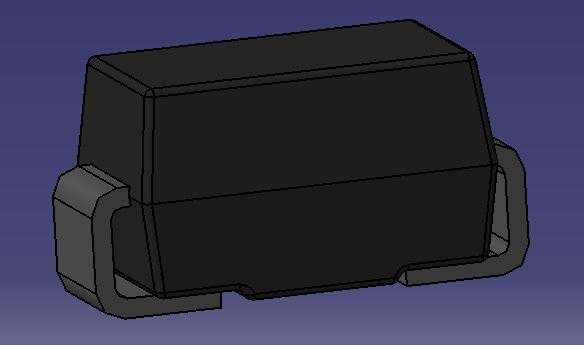
  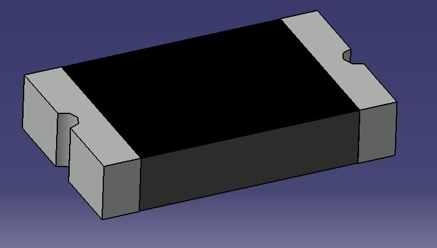
</p>
<p align="center">
  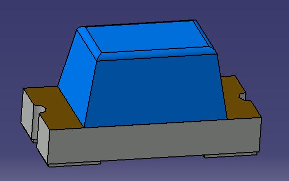
  
  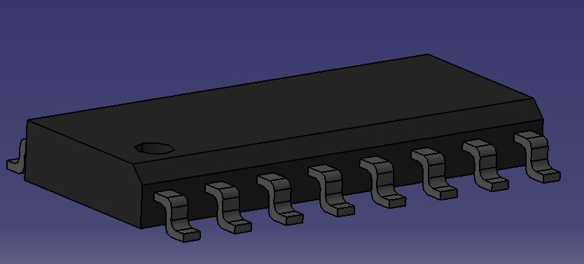
</p>
<p align="center">
  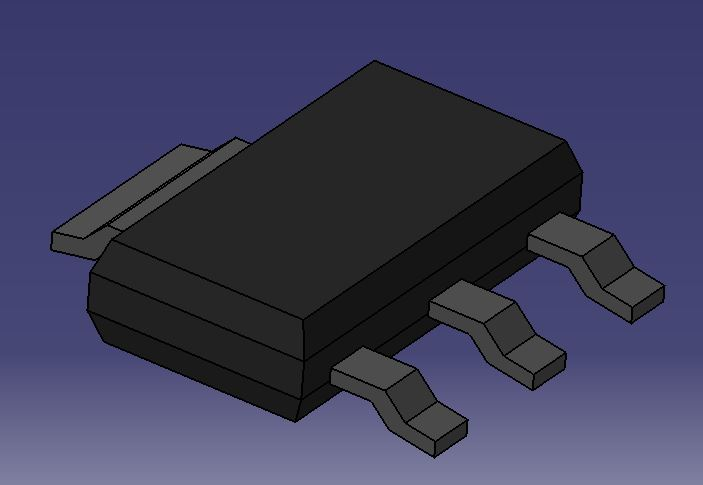
  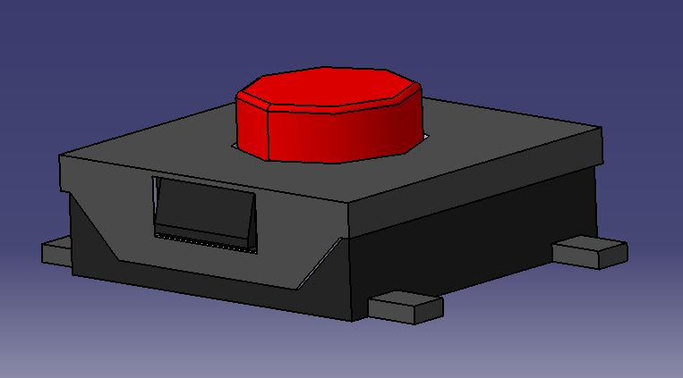
  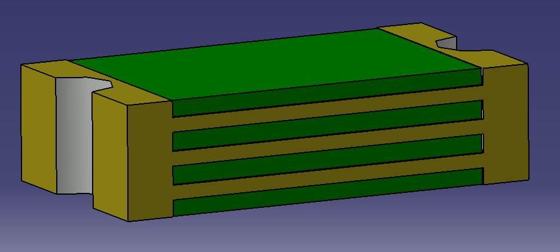
</p>


---

<div align="left">
  <a href="#top">⬆ Voltar ao topo</a>
</div>

---
